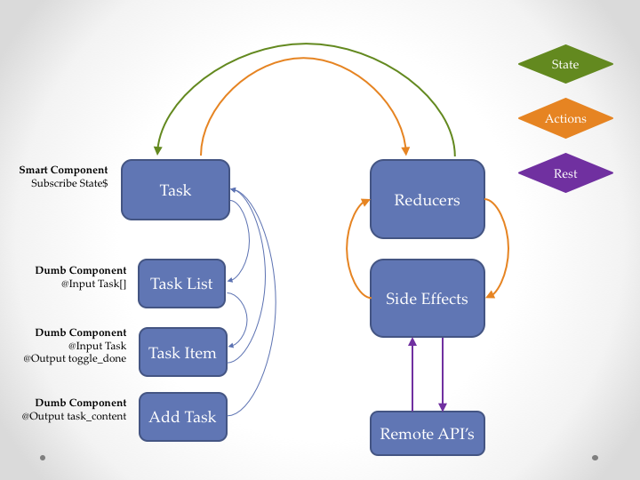

# Reactive Angular Seed
A simple starter project demonstrating the basic concepts of reactive Angular. It uses ngrx/store and ngrx/effects.

This seed demonstrates basic reactive concepts of actions, reducers and side effect. The flow through this seed looks like this:



## How to start

**Note** that this seed project requires node >=v6.11 and npm >=3.10.

### Usage
- Clone or fork this repository
- Make sure you have [node.js](https://nodejs.org/) installed version 6+
- Make sure you have NPM installed version 3+
- run `npm install` to install dependencies
- run `npm start` to fire up dev server
- open browser to [`http://localhost:4200`](http://localhost:4200)
- if you want to use other port, open `angular-cli.json` file, then change port in
```
"defaults": {
      "serve": {
        "port": 1234
      }
    }
```

The base of this project was generated with [Angular CLI](https://github.com/angular/angular-cli) version 1.4.0.
You can use the [Angular CLI] to extend the project.

### Development server

Run `ng serve` for a dev server. Navigate to `http://localhost:4200/`. The app will automatically reload if you change any of the source files.

### Code scaffolding

Run `ng generate component component-name` to generate a new component. You can also use `ng generate directive|pipe|service|class|guard|interface|enum|module`.

### Build

Run `ng build` to build the project. The build artifacts will be stored in the `dist/` directory. Use the `-prod` flag for a production build.

### Running unit tests

Run `ng test` to execute the unit tests via [Karma](https://karma-runner.github.io).

### Running end-to-end tests

Run `ng e2e` to execute the end-to-end tests via [Protractor](http://www.protractortest.org/).
Before running the tests make sure you are serving the app via `ng serve`.

### Further help

To get more help on the Angular CLI use `ng help` or go check out the [Angular CLI README](https://github.com/angular/angular-cli/blob/master/README.md).
